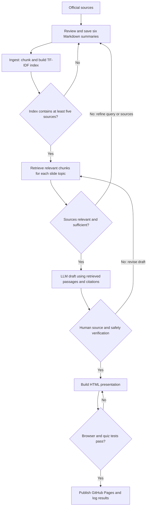

# ScamShield workflow / graph

```mermaid
flowchart TD
 A[Official sources] --> B[Review and save six Markdown summaries]
 B --> C[Ingest: chunk and build TF-IDF index]
 C --> D{Index contains at least five sources?}
 D -- No --> B
 D -- Yes --> E[Retrieve relevant chunks for each slide topic]
 E --> F{Sources relevant and sufficient?}
 F -- No: refine query or sources --> B
 F -- Yes --> G[LLM draft using retrieved passages and citations]
 G --> H{Human source and safety verification}
 H -- No: revise draft --> E
 H -- Yes --> I[Build HTML presentation]
 I --> J{Browser and quiz tests pass?}
 J -- No --> I
 J -- Yes --> K[Publish GitHub Pages and log results]
```

Note: G is a planned LLM step until an actual model invocation and output are recorded. Running ingest.py and retrieve.py alone is not an LLM execution.
